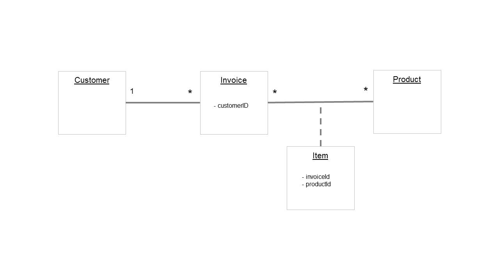

# Create one document for multiple joined rows

One useful feature of rowToDoc is the ability to group multiple rows together to create a single document for one to many joins.  In our customers database, a customer can purchase many items which are captured in an invoice as illustrated by the following E/R diagram.  For this example, we will examine the customer and invoice tables.  These two tables are joined via a one (customer) to many (invoice) relationship.  We have decided that our domain entity for our document is to be based on the customer and the invoices will be represented as children nodes on the entity document. 

Open your customers database (gradle customerDatabase) and executed the following SQL query and view the results. 

    SELECT customer.*,  invoice.id, invoice.total
    FROM invoice LEFT JOIN customer on invoice.customerId = customer.id 
    ORDER BY customer.id

|ID|FIRSTNAME|LASTNAME|ADDRESS|CITY|ID|TOTAL|
|---|---|---|---|---|---|---|
|0|Laura|Steel|429 Seventh Av.|Dallas|0|1721|
|4|Sylvia|Ringer|365 College Av.|Dallas|40|3536|
|4|Sylvia|Ringer|365 College Av.|Dallas|35|2057|
|4|Sylvia|Ringer|365 College Av.|Dallas|18|2518|

The first row represents Laura Steel and an invoice for a total of $1721.  From the previous example, this row could be translated into a single flat (single level) XML document.  But the second, third, and fourth rows represent Sylvia Ringer with three separate invoices.  Here we have a need to represent this _group_ of rows as a single document where the invoices are represented as child elements.  

This is the desired format of our transformed documents.   

    <?xml version="1.0" encoding="UTF-8"?>
    <customer>
      <ID>0</ID>
      <FIRSTNAME>Laura</FIRSTNAME>
      <LASTNAME>Steel</LASTNAME>
      <STREET>429 Seventh Av.</STREET>
      <CITY>Dallas</CITY>
      <invoice>
        <id>0</id>
        <total>1721</total>
      </invoice>
    </customer>

    <?xml version="1.0" encoding="UTF-8"?>
    <customer>
      <ID>4</ID>
      <FIRSTNAME>Sylvia</FIRSTNAME>
      <LASTNAME>Ringer</LASTNAME>
      <STREET>365 College Av.</STREET>
      <CITY>Dallas</CITY>
       <invoice>
         <id>40</id>
         <total>3536</total>
       </invoice>
       <invoice>
         <id>35</id>
         <total>2057</total>
       </invoice>
       <invoice>
         <id>18</id>
         <total>2518</total>
       </invoice>
    </customer>

To acheive this document structure, we can rename the column names in our SQL query to signify grouping.  

    SELECT customer.*, invoice.id as "invoice/id", invoice.total as "invoice/total" 
    FROM invoice LEFT JOIN customer on invoice.customerId = customer.id 
    ORDER BY customer.id

|ID|FIRSTNAME|LASTNAME|ADDRESS|CITY|invoice/id|invoice/total|
|---|---|---|---|---|---|---|
|0|Laura|Steel|429 Seventh Av.|Dallas|0|1721|
|4|Sylvia|Ringer|365 College Av.|Dallas|40|3536|
|4|Sylvia|Ringer|365 College Av.|Dallas|35|2057|
|4|Sylvia|Ringer|365 College Av.|Dallas|18|2518|

Renaming these columns signals to rowToDoc that it should create a child element called _invoice_ and the children elements should be _id_ and _total_.  This works for one to many joins, and can currently only be used for a second level of nesting.  

In this example, we are creating a customer document entity (the one side) with invoice children elements (the many side).  There are two requirements for the SQL query creating in this scenario.  
 
   * The JOIN must be a LEFT JOIN where the LEFT side of the join is the type of document entity you are creating.  
   * The query requires an ordering by the column which is being joined.  In this example, customer ID is being used to facilitate the LEFT JOIN and the query must be ordered by this column.  

## Run rowToDoc

Make sure to close your HSQL Database Manager to release any database locks.

1. Go to the directory where you unzipped the rowToDoc utility.  You will run either the Windows or Unix start script depending on your operating system. 
2. Set the batch configuration parameter.  This value should not change. 
    * --config com.marklogic.spring.batch.config.RowToDoc
3. Set the HSQL parameters
    * --jdbc_driver org.hsqldb.jdbc.JDBCDriver 
        * this is the class for the HSQL JDBC driver.  If you were using a different database then you would need to point to the specific package and class name for the JDBC Driver.  
    * --jdbc_url jdbc:hsqldb:file:c:\\workspace\\rowToDoc\\data\\customers
        * This is database specific and location specific.  Change the project root directory that applies to your local environment.
    * --jdbc_username sa
    * --sql "SELECT customer.*, invoice.id as \"invoice/id\", invoice.total as \"invoice/total\" FROM invoice LEFT JOIN customer on invoice.customerId = customer.id ORDER BY customer.id;"
      * Note the escape slashes on the quotation marks.  These are needed since this is a Java program
4. Set the transform parameters
    * --format xml 
    * --root_local_name customer 
    * --collections customer
5. Set the MarkLogic parameters.  Change these as appropriate.  
    * --host localhost
    * --port 8155 
        * this is the port where the sample rowToDoc appserver was installed
    * --username
    * --password

EXAMPLE

         bin/rowToDoc.bat --host localhost --port 8155 --username admin --password admin --config com.marklogic.spring.batch.config.RowToDoc --jdbc_driver org.hsqldb.jdbc.JDBCDriver --jdbc_url jdbc:hsqldb:file:c:\\workspace\\rowToDoc\\data\\customers --sql "SELECT customer.*, invoice.id as \"invoice/id\", invoice.total as \"invoice/total\" FROM invoice LEFT JOIN customer on invoice.customerId = customer.id ORDER BY customer.id;" --jdbc_username sa --format xml --root_local_name customer --collections customer

